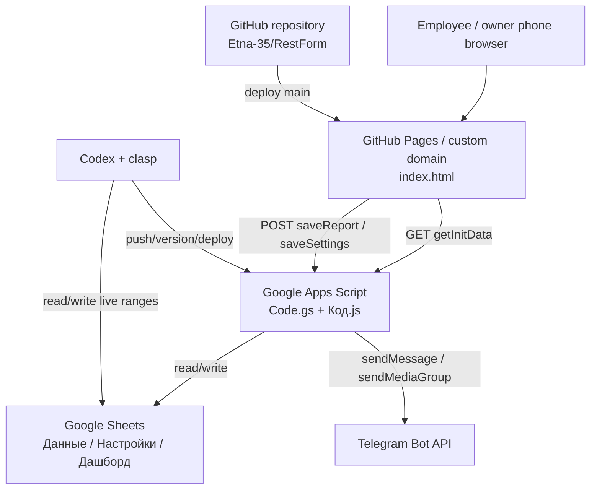

# Architecture

## Directory Tree

```text
RestForm/
├── .clasp.json                 # clasp script binding
├── .claspignore                # files allowed into Apps Script project
├── .codex-memory/              # project memory for future Codex sessions
├── .gitattributes              # git attributes
├── .github/                    # GitHub config / workflows if present
├── .gitignore                  # ignored local files
├── CNAME                       # GitHub Pages custom domain
├── Code.gs                     # Google Apps Script backend
├── Код.js                      # synced Apps Script copy because remote project has Cyrillic file
├── appsscript.json             # Apps Script manifest
├── README.md                   # short project README
├── apps_script_1.js            # older / reserve Apps Script copy
├── docs/
│   ├── CURRENT_AUDIT.md        # current audit notes
│   ├── DEVELOPMENT_WORKFLOW.md # development and deployment workflow
│   └── INTEGRATIONS.md         # integration details
├── etna_smeny.xlsx             # Google Sheets template
├── index.html                  # frontend form published by GitHub Pages
├── package.json                # local check, serve, clasp commands
└── scripts/
    ├── audit-inline-handlers.mjs
    └── check-inline-js.mjs
```

## Data Flow

1. User opens the form from GitHub Pages or the custom domain.
2. `index.html` loads and uses `window.APPS_SCRIPT_URL`.
3. On startup / focus / interval, the frontend calls `GET ?action=getInitData&date=YYYY-MM-DD`.
4. Apps Script reads settings from `Настройки` and previous cash value from `Данные`.
5. Employee enters PIN and fills the form.
6. Frontend calculates live totals for UX.
7. On submit, frontend sends report payload to Apps Script with `POST text/plain`.
8. Apps Script validates old-date rules, recalculates server-side values, finds the row with the selected date in `Данные`, overwrites it, updates previous taxi if needed, and sends Telegram report.
9. Google Sheets powers analytics / dashboard.

The live `Данные` sheet is prefilled with one row per date from 2026-05-01 to 2026-08-31. This prevents gaps when one or more days are skipped and a later day is submitted.

## Diagram



## Integration Points

### Frontend To Apps Script

- URL: `window.APPS_SCRIPT_URL` in `index.html`.
- `GET ?action=getInitData&date=YYYY-MM-DD`
- `GET ?action=getSettings`
- `GET ?action=migrateDataSheet` exists as a maintenance action.
- `POST { action: "saveSettings", ... }`
- `POST { date, employee, cashOpen, ..., yandexFood, ownerOverride, ownerPin }`

`POST` uses `mode: "no-cors"` with `Content-Type: text/plain;charset=utf-8`, so the frontend cannot read the Apps Script response. This avoids browser preflight issues but hides server errors from the UI.

### Apps Script To Google Sheets

- Uses `SpreadsheetApp.getActiveSpreadsheet()`.
- `ensureDataSheet(ss)` creates / formats / migrates `Данные` and enforces canonical A:Y columns.
- `styleYandexFoodColumn(sheet)` keeps the new `Яндекс еда` column aligned with ETNA table style.
- `seedDataCalendar()` is a manual helper for clearing test rows and filling 2026-05-01..2026-08-31.
- `getParams(ss)` reads `Настройки`.
- `getPlansFromSettings(ss)` reads daily plans.
- `getEmployeesFromSettings(ss)` reads employees list.
- `saveReport(data)` writes report rows.
- `saveSettings(data)` updates settings.

### Codex To Google Sheets

- Google Drive/Sheets integration is available and should be used for live sheet inspection and explicit range edits.
- Before structural table edits, read the live sheet because the user may manually edit columns, styles, formulas, or values.
- Manual user edits are allowed; Codex must treat the live spreadsheet as the source of truth.

### Codex To Apps Script

- `clasp` is configured for Script ID `1msQzI7MU3ytVTXrfvXjDhbhIyz7KoOyvROAjugZmunpEyVO7EePFvPCf`.
- Keep `Code.gs` and `Код.js` synchronized before push.
- Deploy to existing deployment ID `AKfycbwVBqxidw_gcAlGVIwIUBU5GIfLtzQ5ULk0fJ2VRpbAWdfI0a1eT37J8ASIxuJkeF0jLw` unless the user intentionally creates a new deployment.

### Apps Script To Telegram

- `sendTelegramReport(data, ctx)` builds short and full messages.
- `telegramText(token, chatId, text)` sends text.
- `telegramPhotos(token, chatId, photos, caption)` sends receipt photos.
- Secrets should come from `PropertiesService`.

### GitHub Pages

- Branch: `main`.
- Domain: `no-money-no-honey.ru`.
- File: `CNAME`.
- Pages publishes `index.html` from repository root.

## Current Architecture Caveats

- Telegram sending during report submit is Apps Script-only. The settings UI still contains Telegram fields for saving values to the server.
- Employee and owner PIN defaults are still present in code. Since the repository is public, this should be moved fully to Settings / Script-side management.
- `doGet?action=migrateDataSheet` is still public maintenance surface. It is less risky than the removed seed endpoint, but should be reviewed before production.
