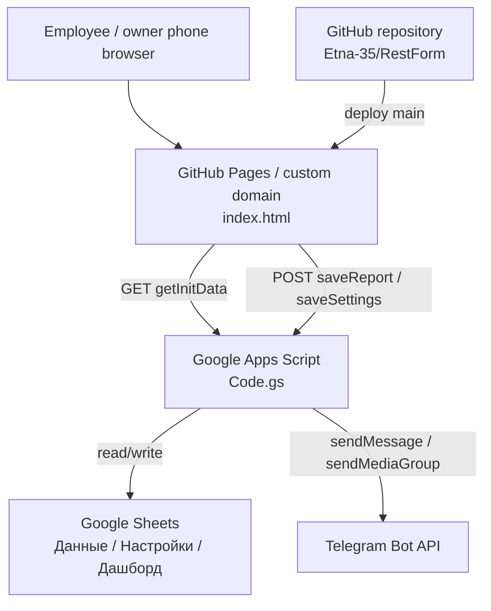

# Architecture

## Directory Tree

```text
RestForm/
├── .codex-memory/              # project memory for future Codex sessions
├── .gitattributes              # git attributes
├── .github/                    # GitHub config / workflows if present
├── .gitignore                  # ignored local files
├── CNAME                       # GitHub Pages custom domain
├── Code.gs                     # Google Apps Script backend
├── README.md                   # short project README
├── apps_script_1.js            # older / reserve Apps Script copy
├── docs/
│   ├── CURRENT_AUDIT.md        # current audit notes
│   ├── DEVELOPMENT_WORKFLOW.md # development and deployment workflow
│   └── INTEGRATIONS.md         # integration details
├── etna_smeny.xlsx             # Google Sheets template
├── index.html                  # frontend form published by GitHub Pages
├── package.json                # local check and serve commands
└── scripts/
    ├── audit-inline-handlers.mjs
    └── check-inline-js.mjs
```

## Data Flow

1. User opens the form from GitHub Pages or the custom domain.
2. `index.html` loads and uses `window.APPS_SCRIPT_URL`.
3. On startup / focus / interval, the frontend calls:
   - `GET ?action=getInitData&date=YYYY-MM-DD`
4. Apps Script reads:
   - settings from `Настройки`
   - previous cash value from `Данные`
5. Employee enters PIN and fills the form.
6. Frontend calculates live totals for UX.
7. On submit, frontend sends report payload to Apps Script with `POST text/plain`.
8. Apps Script validates old-date rules, recalculates server-side values, writes row into `Данные`, updates previous taxi if needed, and sends Telegram report.
9. Google Sheets powers analytics / dashboard.

## Diagram



## Integration Points

### Frontend To Apps Script

- URL: `window.APPS_SCRIPT_URL` in `index.html`.
- `GET ?action=getInitData&date=YYYY-MM-DD`
- `GET ?action=getSettings`
- `POST { action: "saveSettings", ... }`
- `POST { date, employee, cashOpen, ..., ownerOverride, ownerPin }`

`POST` uses `mode: "no-cors"` with `Content-Type: text/plain;charset=utf-8`, so the frontend cannot read the Apps Script response. This avoids browser preflight issues but hides server errors from the UI.

### Apps Script To Google Sheets

- Uses `SpreadsheetApp.getActiveSpreadsheet()`.
- `ensureDataSheet(ss)` creates / formats `Данные`.
- `getParams(ss)` reads `Настройки`.
- `getPlansFromSettings(ss)` reads daily plans.
- `getEmployeesFromSettings(ss)` reads employees list.
- `saveReport(data)` writes report rows.
- `saveSettings(data)` updates settings.

### Apps Script To Telegram

- `sendTelegramReport(data, ctx)` builds short and full messages.
- `telegramText(token, chatId, text)` sends text.
- `telegramPhotos(token, chatId, photos, caption)` sends receipt photos.
- Secrets should come from `PropertiesService`.

### GitHub Pages

- Branch: `main`.
- Domain: `no-money-no-honey.ru`.
- File: `CNAME`.
- Pages publishes `index.html` from repository root.

## Current Architecture Caveats

- `index.html` still contains a legacy client-side Telegram send path. Target architecture is Apps Script-only Telegram sending.
- `Code.gs` currently contains two `isLockedPastDateServer` definitions. JavaScript allows function redeclaration, but this should be cleaned up.
- Employee and owner PIN defaults are still present in code. Since the repository is public, this should be moved fully to Settings / Script-side management.
